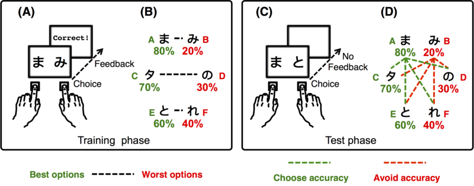
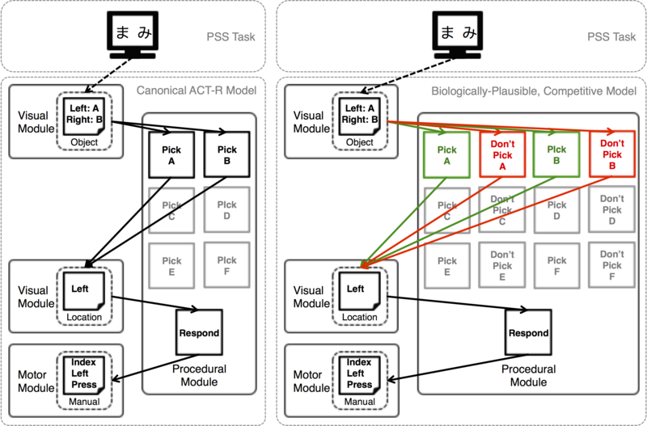

# An ACT-R Model of Direct and Indirect Basal Ganglia Pathways in the PSS Task

This repository contains a series of simulations and analysis of
different models of Michael Frank's Probabilitistic Stimulus Selection
(PSS) task.

A complete review of the data and models of this repository can be
found in the following publcations:

* Stocco, A. (2018). A Biologically Plausible Action Selection System for Cognitive Architectures: Implications of Basal Ganglia
Anatomy for Learning and Decision‐Making Models. _Cognitive Science_, 42(2), 457-490.
    
## Motivation

The motivation for this study was to analyze the extent to which ACT-R
abstraction for the basal ganglia (the so-called "procedural module",
which manages procedural knowledge represented as IF-THEN rules) does
reflect one basic physiological properties of the real basal
ganglia: the presence of two opposing pathways.

While the presence of two opposing pathways might seem a
neurophysiological nuisance, it does have profound implications for
cognition in general. It is also crucial to model the symptoms and
etiology of neurological diseases (such as Parkinson's disease), the
activity of certain drugs (like dopamine agonists and antagonists),
and the nature of individual differences in learning and
decision-making.

## Theory and Description

The repository contains code and simulations from three models, all of
them implemented in the ACT-R architecture, version 7.11
(Lisp-based).

### Task

The model(s) described herein are designed to perform the Probability
Stimuls Selection (PSS) Task, originally described in Frank,
Seeberger, & O'Reilly (_Science_, 2004).



### Models

Three models are included in this repository. All models make a series
of common assumptions.



#### Canonical Model

The first is the canonical model. It uses RL (as implemented in ACT-R's "utility learning" mechanism).

This model is called 'canonical' in the paper because it implements the task in the easiest way using procedural knowledge only. In the code, it is called "noncompetitive" because it does not include the D1/D2 competition that is characteristic of the basal ganglia.

#### Reverse Canonical

The second model is the Reverse Canonical. It is the mirror image of the canonical model and was designed to demonstrate that a bias in preference for otherwise identical options is intrinsic in any RL model. This model is "reversed" in that it only chooses to avoid bad options (i.e., it works as pure D2 system).

#### Competitive Model

The final model is the _competitive_ model that includes both D1 (seek good options) and D2 (avoid bad options) productions. It is the only model capable of fitting the data from multiple papers.

## Implementation

All of the code was designed to run in ACT-R 7.11, that is, before the JSON-based RPC system was introduced. Therefore, all of the code runs entirely inn Lisp (which, incidentally, makes it faster).

The `model` folder contains all of the code to run the different models described in the 2018 paper. Specifically:

1. The `pss-device.lisp` contains the old-style device definition to interact with the PSS task. It also contains a *hook* function that modifies the RL system to allow for competing D1 and D2 production rules.

2. The `pss-model.lisp` contains the main model code (described as _Competitive Model_ in the 2018 paper). The D1/D2 competition is implemented by having each option associated with two competiting production, _Pick <Option>_ and _Don't Pick <Option>_, respectively. 

3. The `pss-model-noncompetitive.lisp` is a model that contains no D1/D2 competition. It is called _Canonical Model_ in the paper because it represents the most straightforward way to implement the task, with each option associated to only one corresponding _Pick <Option>_production rule.  

4. The `pss-simulations.lisp` file contains useful functions and macros for running hindreds of simulations across parameters. These functions were used to generate the data collected in the `simulations` options.
    
Other files in the folder were used to generate alternative models and data that were eventually left out of the 2018 paper. 
    
### Usage
    The only way to use the Fast code is through a Lisp interpreter, after
ACT-R has been loaded. If you are using the Stand-Alone version of
ACT-R, then you (obviously) do not need to load ACT-R. Otherwise, you
need to load ACT-R by typing the following command on your REPL prompt:

```lisp
(load "/path/to/actr/load-act-r.lisp")
```

To start a simulation, one must first load the `pss-device.lisp` file:

```lisp
(load "pss-device.lisp")
```    

Then, you want to load the specific model fuile you inbtend to run, e.g., the "competitive" model:
    
```lisp
(load "pss-model.lisp")
```
    
Optionally, you might want to load the functions to run multiple simulations:
    
```lisp
(load "pss-simulations.lisp")
```
    
Finally, you can run the code using ACT-R's `run` function:
    
```lisp
(run 1000)
```
