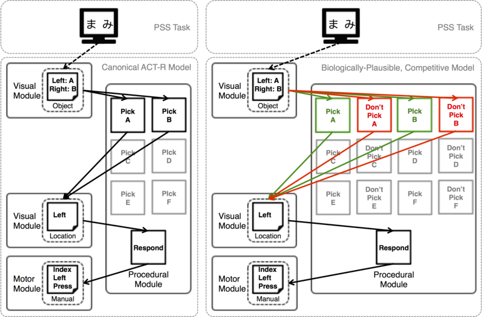

# Procedural ACT-R Model of the PSS Task

This repository contains a series of simulations and analysis of
different models of Michael Frank's Probabilitistic Stimulus Selection
(PSS) task.

A complete review of the data and models of this repository can be
found in the following publcations:

...Stocco, A. (2018). A Biologically Plausible Action Selection
...System for Cognitive Architectures: Implications of Basal Ganglia
...Anatomy for Learning and Decision‐Making Models. _Cognitive
...Science_, 42(2), 457-490.
    

## Motivation

The motivation for this study was to analyze the extent to which ACT-R
abstraction for the basal ganglia (the so-called "procedural module",
which manages procedural knowledge represented as IF-THEN rules) does
reflect one basic physiological properties of the real basal
ganglia: the presence of two opposing pathways.

While the presence of two opposing pathways might seem a
neurophysiological nuisance, it does have profound implications for
cognition in general. It is also crucial to model the symptoms and
etiology of neurological diseases (such as Parkinson's disease), the
activity of certain drugs (like dopamine agonists and antagonists),
and the nature of individual differences in learning and
decision-making.

## Implementation

The repository contains code and simulations from three models, all of
them implemented in the ACT-R architecture, version 7.11
(Lisp-based).

### Task

The model(s) described herein are designed to perform the Probability
Stimuls Selection (PSS) Task, originally described in Frank,
Seeberger, & O'Reilly (_Science_, 2004).

### Models

Three models are included in this repository. All models make a series
of common assumptions.

#### Canonical Model

The first is the canonical model to perform

### Alternative models
